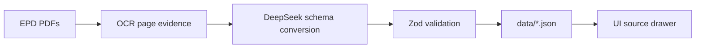

# Extraction approach

I treated provenance as the main problem. A carbon number without a page and quote is not useful for this assessment, because the app is meant to support real procurement decisions. So the extraction flow keeps evidence attached from the PDF all the way through to the UI.

The pipeline starts with the PDFs in `Resources/`. `scripts/extract-epds.ts` runs the OCR step, writes raw evidence to `.extraction-raw/`, sends that evidence to DeepSeek with the TypeScript schema, validates the response with Zod, and writes one JSON file per EPD into `data/`.

I first looked at native PDF text extraction, but it missed too much. Several EPD result tables are embedded as images or vector content, and some are laid out sideways. In those cases the text layer can give you the table heading while dropping the actual numbers. That is worse than a noisy OCR result because it looks complete when it is not. The Python script therefore renders pages with PyMuPDF and OCRs them with Tesseract. Normal pages use 200 DPI and page segmentation mode 4. Rotated pages are retried with page rotations and page segmentation mode 12, which worked better on sideways tables and scientific notation.

I kept Python limited to PDF rendering and OCR. TypeScript owns the prompt, retry logic, schema conversion, and validation because the app is also TypeScript. The same contract used by the UI defines the lifecycle modules I extract: `A1-A3`, `A4`, `A5`, `B1-B7`, `C1`, `C2`, `C3`, `C4`, and `D`.

The extraction rules are intentionally conservative. `A1-A3` must come from Product stage `GWP-total` evidence. Additional indicator tables and non-total GWP rows are ignored. `B1` to `B7` are only summed when all seven values are explicitly reported. `ND`, missing, and not found stay `null`; I do not treat them as zero. I also avoided silent unit conversion. If the declared unit cannot be normalized to `1 m3`, the output keeps a data quality flag.

Accuracy is checked in a few places. The raw OCR output keeps page-level evidence for review. The schema rejects reported carbon values without a value, unit, source page, and quote. The converter adds stricter checks for `A1-A3` so weak Product stage evidence does not slip through. In the app, the source drawer shows the quote and PDF page instead of asking users to trust the JSON on its own.

The weak point is still OCR. Tesseract can misread punctuation, units, and scientific notation. I handled that by flagging unsupported values instead of filling gaps. With more time, I would add a small hand-labelled golden set and compare the generated JSON against it before extracting more documents.
