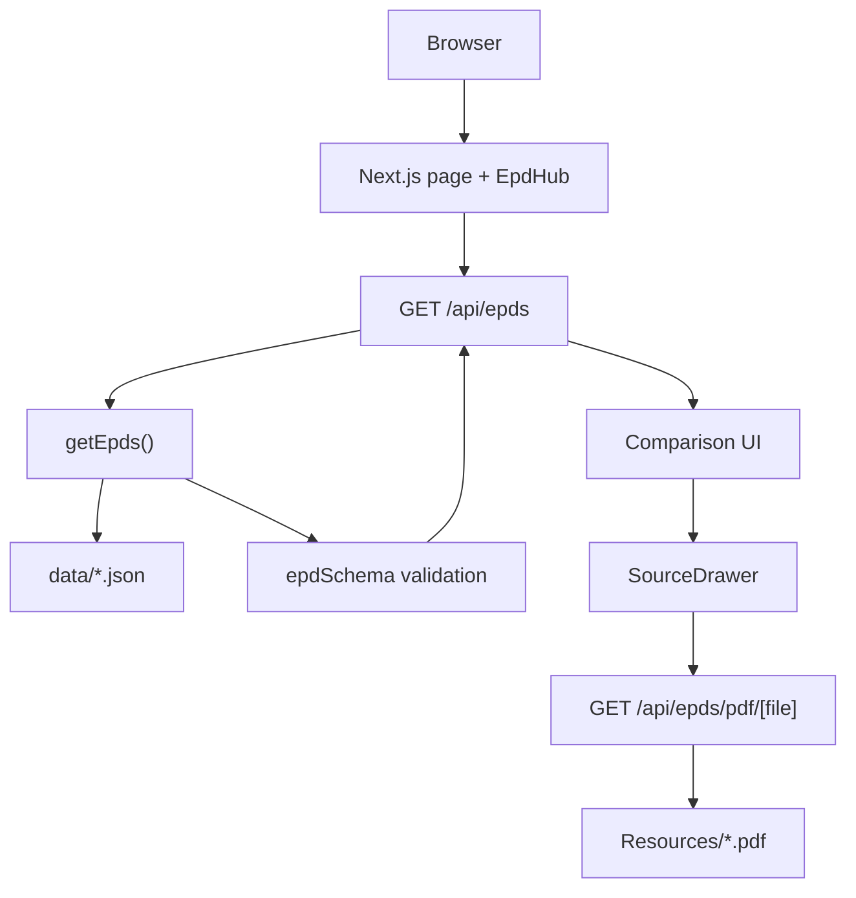
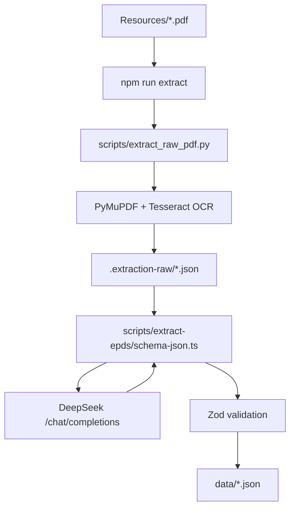

# Architecture

## Purpose

The Low Carbon Materials Hub helps compare concrete products by embodied carbon using structured data extracted from Environmental Product Declaration PDFs. The system is optimized for honest comparison rather than broad data coverage: missing data stays visible, units and incomplete modules are called out, and carbon values are traceable back to the source PDF.

## High-Level Shape

Runtime requests use only local JSON and PDF files that ship with the app:

Extraction is an offline workflow that refreshes the JSON files consumed by the app:

Runtime has no database, no LLM calls, and no required environment variables. The LLM API key is only needed for offline extraction or schema conversion.

## Runtime Architecture

The production app is a single Next.js application.

- `src/app/page.tsx` renders the main page shell and mounts `EpdHub`.
- `src/features/epds/components/epd-hub.tsx` is the client entry point. It fetches `/api/epds`, tracks loading/error/ready state, and displays summary metrics.
- `src/app/api/epds/route.ts` exposes validated EPD data as JSON.
- `src/server/epds/read-epds.ts` reads every `data/*.json` file and parses each object through `epdSchema`.
- `src/app/api/epds/pdf/[file]/route.ts` streams a source PDF from `Resources/` for inline preview.

There is no database or external runtime service. The deployable artifact includes the JSON and PDF files in the repository.

## Module Boundaries

### Shared Schema

`src/shared/epd/schema.ts` is the contract between extraction, validation, API output, and frontend rendering. It defines:

- supported lifecycle modules;
- field statuses;
- source quote shape;
- sourced numeric field shape;
- complete EPD object shape;
- Zod refinements that reject reported carbon values without value, unit, and source evidence.

### Server Layer

`src/server/epds/read-epds.ts` is deliberately small. Its only job is to load local JSON files, sort them by filename, parse them with the shared schema, and return typed data.

This keeps validation at the boundary where untrusted JSON enters the app.

### API Layer

The app has two API routes:

- `GET /api/epds` returns `{ epds }`.
- `GET /api/epds/pdf/[file]` streams a PDF from `Resources/`.

The PDF route validates the file extension, strips a leading `Resources/` prefix if present, resolves the path, and rejects paths outside the `Resources/` directory to prevent directory traversal.

### Feature UI

The `src/features/epds` folder owns the comparison experience:

- `Comparison` manages filters and source-selection state.
- `ComparisonTable` renders products, lifecycle stages, totals, and row status.
- `SourceDrawer` displays PDF evidence and explanation for reported, missing, incomplete, and row-level status selections.
- `SearchableMultiSelect` is a reusable filter control.
- `comparison-formatting.ts` owns display formatting, total calculation, status labels, and product display normalization.

## Data Flow

1. The browser loads `/`.
2. `EpdHub` fetches `/api/epds`.
3. The API route calls `getEpds()`.
4. `getEpds()` reads and validates `data/*.json`.
5. The browser stores the returned EPD list in React state.
6. `Comparison` derives filter options, filtered rows, warning badges, and sort order with `useMemo`.
7. `ComparisonTable` renders raw lifecycle stage values and computed totals.
8. Clicking a value stores a `SourceSelection`.
9. `SourceDrawer` renders source details and requests `/api/epds/pdf/[file]#page=N`.

## Comparison Rules

The comparison layer follows these rules from `comparison-formatting.ts`:

- `A1-A5` upfront total is complete only when `A1-A3`, `A4`, and `A5` are all reported.
- Life cycle `A-C` total is complete only when every lifecycle module except `D` is reported.
- Module `D` is displayed separately because it is beyond the system boundary.
- If some required modules are reported and others are missing, the total status is `incomplete` and lists missing modules.
- If no required modules are reported, the total status is `no_data`.
- Rows whose declared unit is not normalized to `1 m³` receive a `Needs normalization` status.

## Extraction Architecture

Extraction is an offline workflow, not part of request handling.

- `scripts/extract-epds.ts` orchestrates raw extraction and schema conversion.
- `scripts/extract_raw_pdf.py` renders PDF pages and OCRs them with Tesseract.
- `scripts/extract-epds/raw-pdf.ts` calls the Python extractor and compacts raw evidence for LLM input.
- `scripts/extract-epds/schema-json.ts` prompts the LLM, normalizes identity fields, repairs weak A1-A3 source quotes when possible, and validates output.
- `scripts/validate-data.ts` validates all generated JSON files and is part of `npm run build`.

This keeps costly OCR and LLM work outside the web app while still enforcing the same schema used by the web runtime.

## Important Architectural Tradeoffs

### Local Files Instead of Database

The app reads JSON from `data/` and PDFs from `Resources/`. This is appropriate for a fixed assessment data set and makes provenance easy to audit in Git. A database would only become useful once products are edited, uploaded by users, or updated continuously.

### Client-Side Filtering

All EPD data is fetched once and filtered in the browser. With 20 products this is simpler and faster than server-side filtering. For a larger catalog, filtering and pagination should move to the server.

### Shared Zod Contract

The same schema validates extraction output, build-time data, and runtime API data. This reduces the chance that extraction and UI expectations drift.

### Conservative Totals

The UI avoids filling missing stages with zero. This can reduce the number of complete comparisons, but it avoids understating embodied carbon.

## Future Improvements

See [Architecture Improvements](./architecture-improvements.md) for the proposed automation and database-backed architecture direction.

## Extension Points

- Add new lifecycle fields by extending `src/shared/epd/schema.ts`, then updating extraction prompts and UI rendering.
- Add server-side search or pagination by replacing direct client filtering in `Comparison` with query parameters on `/api/epds`.
- Add manually reviewed golden data by adding tests around `scripts/extract-epds/schema-json.ts` and fixtures for known PDFs.
- Add persistence by replacing `getEpds()` with a repository interface while keeping `epdSchema` as the boundary validator.
